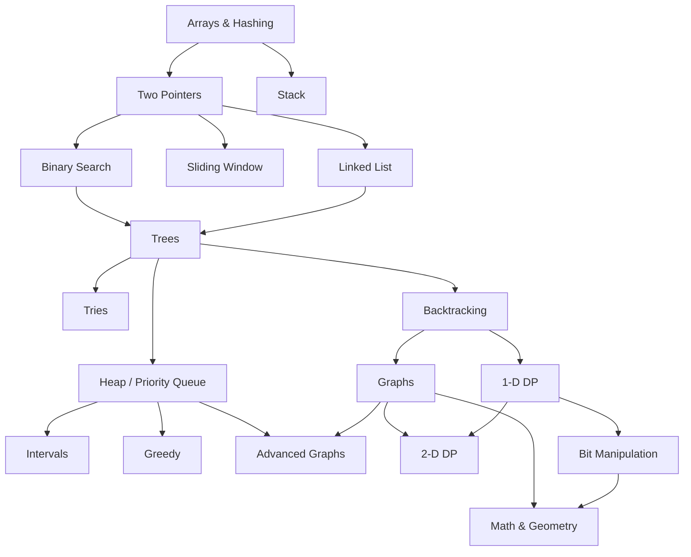

# Dashboard

##### Algorithms
* 
##### Data Structures

##### Maths
* [[Analysis]]
* [[Number Theory]]
* [[Combinatorics]]
##### Patterns

```mermaid
graph TD
  A[Arrays & Hashing]
  B[Two Pointers]
  C[Stack]
  D[Binary Search]
  E[Sliding Window]
  F[Linked List]
  G[Trees]
  H[Tries]
  I[Heap / Priority Queue]
  J[Intervals]
  K[Greedy]
  L[Advanced Graphs]
  M[Backtracking]
  N[Graphs]
  O[1-D DP]
  P[2-D DP]
  Q[Bit Manipulation]
  R[Math & Geometry]

  A --> B
  A --> C
  B --> D
  B --> E
  B --> F
  D --> G
  F --> G
  G --> H
  G --> I
  G --> M
  I --> J
  I --> K
  I --> L
  M --> N
  M --> O
  N --> L
  N --> P
  N --> R
  O --> P
  O --> Q
  Q --> R

  %% Attach the internal-link class to nodes
  class A,B,C,D,E,F,G,H,I,J,K,L,M,N,O,P,Q,R internal-link;
```

