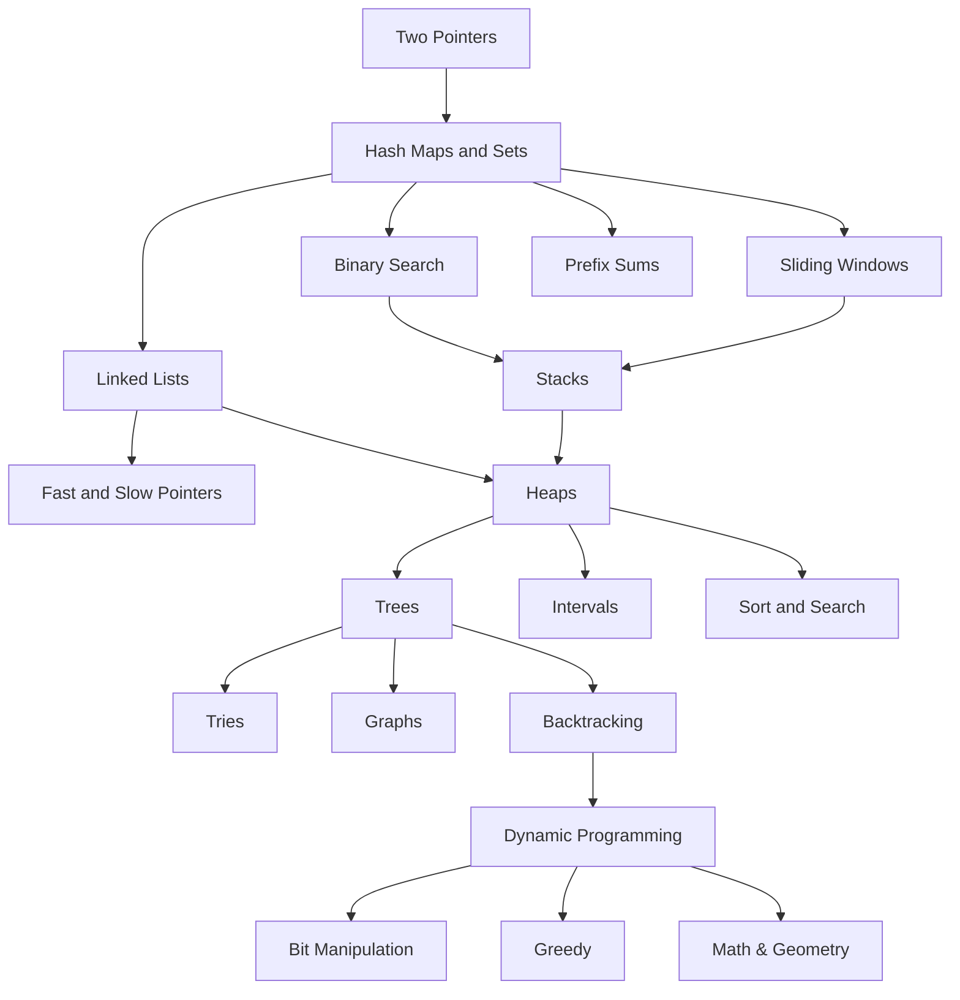

# Dashboard

## Patterns


## Data Structures

![[Drawing 2024-12-14 11.48.16.excalidraw | center | 1000]]

````col
```col-md
**Sequence Containers**
* [[Array]]
* [[Vector]]
* [[Forward List]]
```
```col-md
**Container Adapters**
* [[Stack]]
* [[Queue]]
* [[Priority Queue]]
```
````
````col
```col-md
**Associative Containers
(Binary Search Tree)**
* [[Set]]
* [[Map]]
* [[Multiset]]
* [[Multimap]]
```
```col-md
**Unordered Associative Containers (Hash Table)**
* [[Unordered Set]]
* [[Unordered Map]]
* [[Unordered Multiset]]
* [[Unordered Multimap]]
```
````
## Algorithms

* [[DFS]]
* [[BFS]]

## Maths

* [[Analysis]]
* [[Number Theory]]
* [[Combinatorics]]

## Problem Solving Strategies
